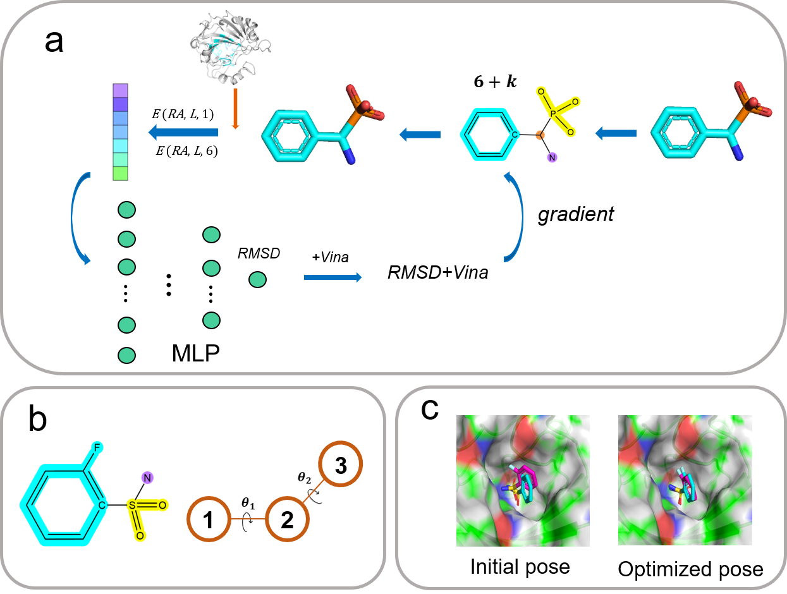

# DeepRMSD+Vina
DeepRMSD+Vina is a computational framework that integrates optimization and screening of ligand binding poses.

## Install 

    conda install -c conda-forge spyrmsd
    conda install pytorch
    conda install numpy pandas
    conda install 

## Contact
Liangzhen Zheng, Shanghai Zelixir Biotech Company Ltd, astrozheng@gmail.com

Zechen Wang, Shandong University, wangzch97@163.com

## Usage 
### 1. Prepare pdbqt files for proteins and ligands, which can be generated via MGLTools.
The detailed process is as follows.

    pythonsh prepare_receptor4.py -r protein.pdb -U lps -o protein.pdbqt
    pythonsh prepare_ligand4.py -l ligand.mol2 -U lps -o ligand.pdbqt 
    
Also, you can get the pdbqt files through OpenBabel,
    
    conda install -c openbabel openbabel
    obabel protein.pdb -O protein.pdbqt
    obabel ligand.mol2 -O ligand.pdbqt

### 2. Prepare the input file with a protein PDBQT file and a ligand PDBQT file written on each line, separated by a space.
The content of the input file is as follows
    
    ./samples/1a30/1a30_protein_atom_noHETATM.pdbqt  ./samples/1a30/docking_poses/1a30_decoy01.pdbqt
    ./samples/2qbp/2qbp_protein_atom_noHETATM.pdbqt  ./samples/2qbp/docking_poses/2qbp_decoy01.pdbqt
    
### 3. Run the optimization framework with default parameters included in scripts.

    bash run_pose_optimization.sh poses_inputs.dat

Finally, the program outputs the optimized ligand conformation ("final_optimized_cnfr.pdb"). In addition, the conformation changes during optimization are recorded in the "optim_traj.pdb" file.
